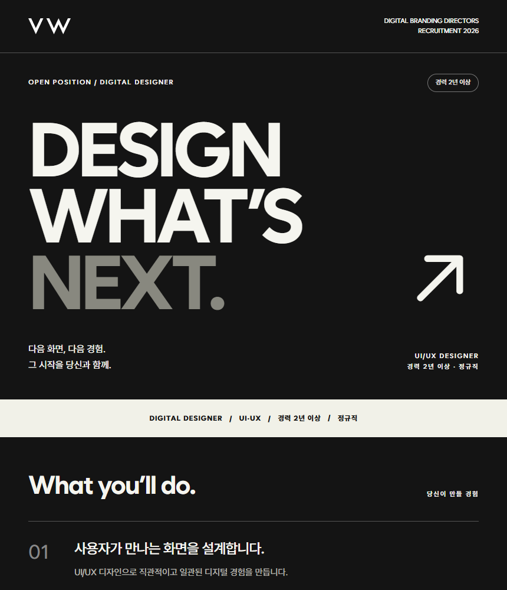
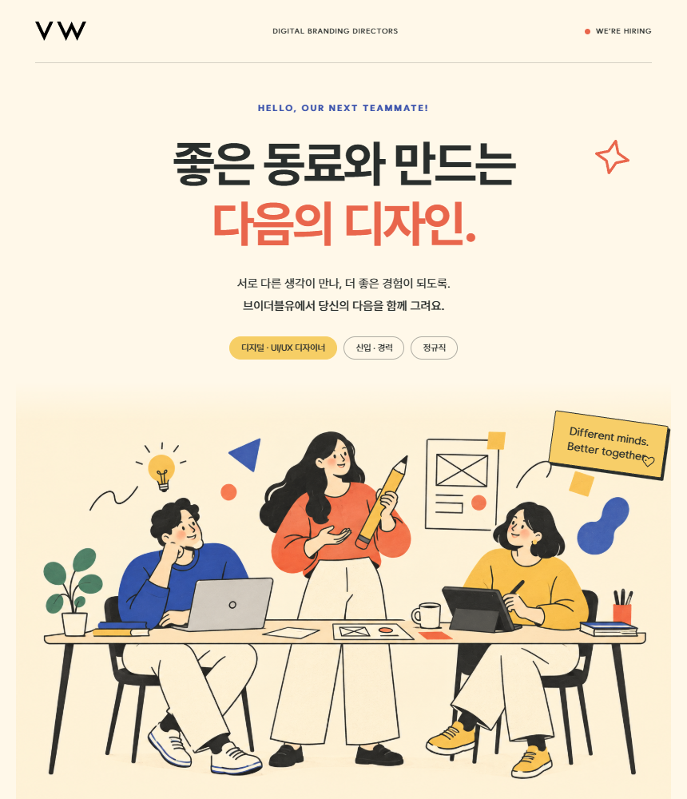

<p align="center">
  <a href="https://rukawa-dev.github.io/vw-jobkorea/">
    
  </a>
</p>

<p align="center">
  <strong>브이더블유 채용공고 디자인 아카이브</strong><br>
  다양한 직무와 채용 회차의 공고를 모아, 디자인하고 기록합니다.
</p>

## 🗂️ 프로젝트 소개

새로운 채용이 열릴 때마다 공고와 디자인을 추가해 나가는 아카이브입니다. 특정 직무나 시안 개수에 범위를 한정하지 않습니다.

- 🗓️ **등록일별 기록** — 채용 회차별 공고를 찾고 이전 공고를 보관합니다.
- 🎨 **공고별 디자인** — 직무와 채용 목적에 맞는 시안을 제작합니다.
- 📋 **게시용 HTML** — 완성한 공고를 잡코리아 편집기에 붙여 넣습니다.

## 🎨 제작 예시

아래는 현재 등록된 디자이너 공고의 시안입니다. 앞으로 추가되는 공고는 각 채용에 맞게 구성합니다.

| 🤍 A · 에디토리얼 | 🖤 B · 타이포 포스터 | 💛 C · 스튜디오 |
| :---: | :---: | :---: |
|  |  |  |
| 여백과 차분한 타이포그래피 | 대담한 글자와 선명한 대비 | 2D 캐릭터와 친근한 분위기 |

현재는 디자이너와 기획자/PM 공고가 등록되어 있습니다. A·B·C는 이번 공고의 시안 구성이며, 모든 공고에 적용되는 고정 형식은 아닙니다.

## 📋 잡코리아에 사용하는 방법

**등록일별 목록 → 채용공고 선택 → 시안 선택 → HTML 코드 복사**

1. 운영 사이트에서 원하는 채용공고를 선택합니다.
2. **채용공고 HTML 코드** 버튼을 누릅니다.
3. ‘공고 이미지가 준비되었습니다’를 확인하고 **HTML 코드 복사**를 누릅니다.
4. 잡코리아 편집기의 **HTML 모드**에 붙여 넣고 미리보기를 확인합니다.

기본 표시 방식은 **PC + MO 자동 전환**입니다. `<picture>`를 사용해 화면 너비 767px 이하에서는 MO 이미지, 그보다 넓으면 PC 이미지를 표시합니다. 두 이미지가 모두 준비되면 복사할 수 있고, 이미지 주소 변경에서 PC·MO 주소를 각각 지정할 수 있습니다. 잡코리아의 태그 지원 여부는 저장 후 PC·모바일에서 확인해야 합니다. 필요하면 **PC 이미지 공통 사용**으로 전환하세요.

`npm run export:png`는 6개 시안 각각의 PC(860px)·MO(390px) 레이아웃을 3배 해상도로 생성합니다. 기존 PC 파일명은 유지하며, MO 이미지는 `VW-A-MO-3x.png`와 같은 이름으로 저장합니다. MO는 기존 모바일 레이아웃의 세로 배치와 글자 크기를 사용합니다. 새 이미지가 공개 서버에 배포되어야 기본 공개 주소로 복사할 수 있습니다.

> 공고 이미지를 클릭하면 [브이더블유 홈페이지](https://www.v-w.co.kr/)가 새 창으로 열립니다. 지원 접수는 이 사이트에서 처리하지 않습니다.

이미지 주소는 GitHub Pages에 배포된 파일로 자동 입력됩니다. 다른 서버의 이미지를 쓰는 경우에만 **이미지 주소 변경**을 펼치세요. 로그인 없이 열리는 공개 주소가 필요하며, localhost나 내부 IP는 사용할 수 없습니다.

## ⚡ 로컬 실행

Node.js 24와 Microsoft Edge가 설치된 환경을 기준으로 합니다.

```sh
npm ci
npm run dev
```

| 명령어 | 하는 일 |
| --- | --- |
| `npm run dev` | 개발 서버 실행 · 수정 내용 자동 반영 |
| `npm run build` | 이미지 생성 + 사이트 빌드 + 네트워크 미리보기 |
| `npm run build:only` | 이미지와 `dist` 생성 후 종료 |
| `npm run preview` | 기존 `dist`로 네트워크 미리보기 실행 |
| `npm run export:png` | 공고 이미지와 미리보기만 다시 생성 |

**다른 기기에서 확인:** `npm run build` 후 터미널의 **Network** 주소로 접속합니다. 예: `http://192.168.0.10:4173/`. 같은 네트워크에서 사용할 수 있고, IP는 PC 환경에 따라 달라집니다. 종료는 `Ctrl+C`입니다.

## 🚀 GitHub Pages 배포

1. 저장소 **Settings → Pages → Source → GitHub Actions**를 선택합니다.
2. 변경 사항을 **main** 브랜치에 커밋하고 푸시합니다.
3. **Actions → Deploy GitHub Pages**가 성공하면 운영 사이트를 확인합니다.

```text
main에 push → 공고 이미지 생성 → Vite 빌드 → GitHub Pages 배포
```

워크플로가 Node.js 24와 Chromium을 준비하고, `/vw-jobkorea/` 경로와 공개 이미지 주소를 자동 설정합니다. 별도 도메인은 필요하지 않습니다. CI에서는 서버까지 실행하는 `npm run build` 대신 `npm run build:only`를 사용합니다.

## 🛠️ 수정할 파일 찾기

| 수정할 내용 | 파일 / 폴더 |
| --- | --- |
| 등록일·마감일·직무별 목록 | [src/recruitments.js](src/recruitments.js) |
| 메인 목록 화면·헤더 | [src/RecruitmentList.jsx](src/RecruitmentList.jsx) |
| 시안 비교 화면·페이지 연결 | [src/main.jsx](src/main.jsx) |
| 디자이너 A·B 공통 내용 | [Sections.jsx](src/pages/Sections.jsx) |
| 기획자 A·B 공통 내용 | [PlannerSections.jsx](src/pages/PlannerSections.jsx) |
| C안 내용 | [Studio.jsx](src/pages/Studio.jsx) · [PlannerStudio.jsx](src/pages/PlannerStudio.jsx) |
| HTML 코드 팝업 | [HtmlCodeDialog.jsx](src/HtmlCodeDialog.jsx) |
| 사진·캐릭터·로고 | [public/imgs](public/imgs) |
| 자동 생성되는 공고 이미지 | [public/downloads](public/downloads) |
| 원문 채용 기준 | [디자이너](docs/designer-source.md) · [기획자/PM](docs/planner-source.md) |

**새 공고 추가 시:** 실제 등록일(`registeredAt`), 고유 ID, 마감일, 직무, 시안 수와 경로를 등록합니다. 날짜는 최신순으로 정렬됩니다. 같은 직무의 새 회차도 별도 공고로 추가해 이전 기록을 보존하세요.

현재 상세 화면과 이미지 생성 대상은 코드에 직접 연결되어 있습니다. 목록 데이터 추가와 함께 `src/main.jsx`의 시안·경로 및 `scripts/export-png.mjs`의 출력 대상도 연결해야 합니다. 이미지 파일명과 HTML 팝업의 저장 키는 공고별로 구분합니다.

<details>
<summary><strong>🧩 현재 등록된 공고의 경로와 이미지 생성 설정</strong></summary>

| 화면 | 디자이너 | 기획자/PM |
| --- | --- | --- |
| 시안 비교 | `#/designer` | `#/planner` |
| A · 에디토리얼 | `#/editorial` | `#/planner/editorial` |
| B · 타이포 포스터 | `#/poster` | `#/planner/poster` |
| C · 스튜디오 | `#/studio` | `#/planner/studio` |

첫 화면은 `#/`입니다. 해시 경로를 사용해 정적 호스팅에서도 상세 페이지 새로고침이 가능합니다.

- 공고 PNG는 가로 **860 CSS px × 3배 = 2,580px**로 생성합니다.
- 디자이너 파일은 `VW-A/B/C-3x.png`, 기획자는 `VW-PM-A/B/C-3x.png`입니다.
- 로컬 이미지 생성은 Microsoft Edge를 사용합니다. 다른 브라우저는 `PNG_BROWSER_CHANNEL` 또는 `PNG_BROWSER_PATH` 환경변수로 지정합니다.
- 공개 이미지 기본 주소는 `VITE_PUBLIC_SITE_URL`, 배포 경로는 `VITE_BASE_PATH`로 설정합니다.
- 직접 입력한 이미지 주소는 복사 성공 시 해당 시안별로 브라우저에 저장됩니다.
- 팝업은 Esc로 닫을 수 있습니다. 자동 복사가 안 되는 환경에서는 코드 수동 복사를 안내합니다.

</details>

<details>
<summary><strong>📦 참고 원본 다시 가져오기</strong></summary>

```sh
node scripts/import-reference.mjs <참고폴더>
```

이 명령은 A·B안과 공통 섹션의 생성 파일을 덮어씁니다. 수정한 내용이 있다면 실행 전에 확인하세요. C안은 가져오기 대상에서 제외됩니다.

</details>
