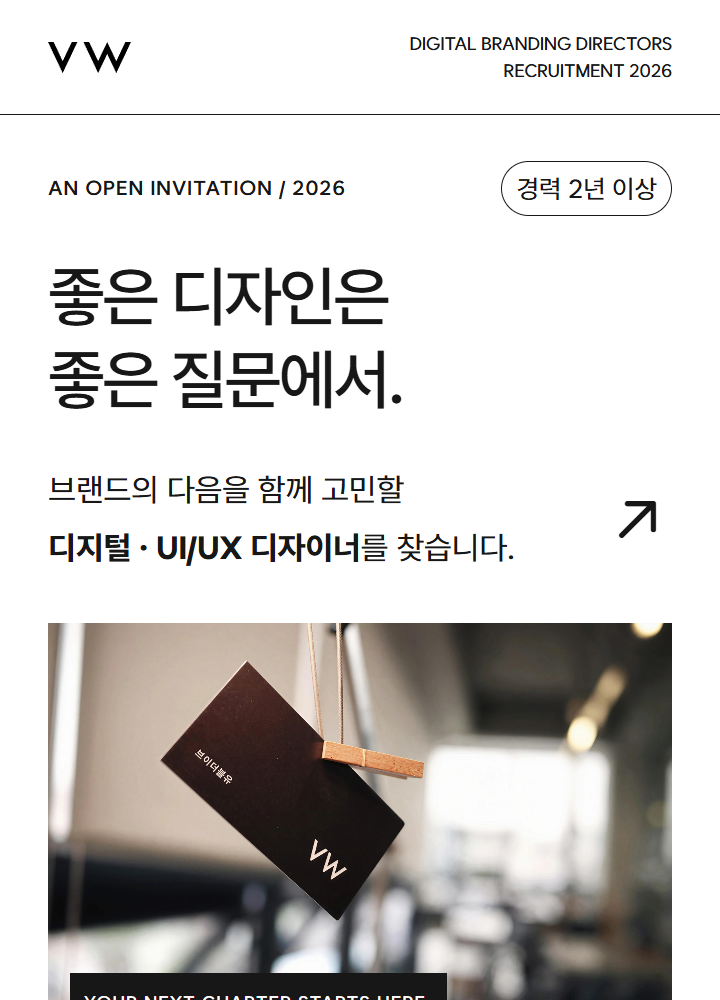

# A · 에디토리얼 — 디자인 컨셉 v1

기준일: 2026-09-26 · 컨셉 ID: `editorial-v1` · 용도: 직무와 채용 회차가 달라도 동일한 시각 언어로 제작하는 채용공고.

[공통 제작 규칙](README.md)과 함께 사용한다. 이 문서는 현재 구현을 기준으로 작성한 디자인 명세다. 아래 참고 이미지는 기준일의 상단 미리보기를 별도로 보관한 것으로, 새 공고 이미지 생성 시 덮어쓰지 않는다.

## 컨셉과 인상

**여백으로 전하는 자신감.** 흰 종이 위에 짧은 문장, 얇은 선, 실제 공간 사진을 놓은 편집 디자인이다. 화려한 장식보다 브랜드의 태도와 함께 일할 사람에게 건네는 차분한 초대에 집중한다.

한글 핵심 문장을 먼저 읽고, 회사의 분위기를 본 다음 업무와 조건을 확인하는 흐름을 유지한다. 사진은 장식용 소재보다 실제 VW 공간과 브랜드의 흔적을 사용한다.

## 유지할 디자인

| 요소 | 기준 |
| --- | --- |
| 기본 배경 / 주요 글자 | `#ffffff` / `#171717` |
| 보조 본문 | `#62625c` |
| 자격요건 영역 | `#f3f3ef` |
| 회사 생활 설명 영역 | `#efefeb` |
| 서체 | Wanted Sans, 기본 400·중간 강조 500·핵심 정보 700 |
| 레이아웃 | 단일 세로 흐름. 본문·업무·자격요건·조건을 1열로 읽는다. |
| 구분 장치 | 얇은 수평선, 작은 영문 라벨, 업무 순번 01·02·03… |
| 히어로 | 한글 중심 2행 안팎의 짧은 선언. 아래에 직무 소개와 ↗ 화살표. |
| 사진 | 컬러 유지. 첫 사진은 좌우 본문 여백 안에 배치. 사무실 사진은 간판과 회사명이 잘리지 않게 전체 표시. |
| 지원 영역 | 흰 배경 유지, 상단 진한 구분선. 별도 버튼 그림 대신 텍스트 안내. |

기준 폭은 720 CSS px다. 좌우 주요 여백은 `6.667cqw`(약 48px), 일반 섹션 상하 여백은 `7cqw`(약 50.4px)다. 작은 화면에서도 비례 축소되는 한 장의 게시 이미지로 구성한다.

| 타이포 역할 | 현행 공통 CSS 기준 | 720px 표시 시 |
| --- | --- | --- |
| 히어로 제목 | `9.2cqw`, 행간 1.25, 자간 `-.4cqw` | 약 66.2px |
| 주요 본문 | `4.445cqw`, 행간 1.8 | 약 32px |
| 일반 소제목 | `6.1cqw`, 행간 1.4 | 약 43.9px |
| 업무 제목·조건 값 | `5.56cqw`, 행간 1.5 | 약 40px |
| 지원 마무리 제목 | `8.8cqw` | 약 63.4px |

수치는 `common-artwork.css`의 최종 비례 규칙을 기준으로 한다. 개별 CSS에 남아 있는 초기 860px 레이아웃 값을 복사해 새 기준으로 사용하지 않는다.

## 섹션 순서

1. VW 로고 + 영문 브랜드명 + 채용 연도.
2. 초대 라벨 + 경력 배지 + 한글 핵심 제목 + 직무 소개.
3. 컬러 브랜드 사진 + 작은 영문 캡션.
4. 직무·전문분야·경력·고용형태 요약 띠.
5. 회사 소개: 짧은 제목과 브랜드의 일하는 태도.
6. 담당 업무: 번호, 업무 제목, 설명.
7. 필수 조건과 우대사항: 연한 회색 배경.
8. 회사 생활: 사무실 사진 다음 복지 설명.
9. 근무 조건: 고용형태·급여·시간·장소.
10. 지원 안내: 마무리 제목 → 전형 절차 → 제출 자료 → 지원 방법 → 유의사항 → 회사 로고와 사이트.

공고에 맞게 항목 수와 전체 높이는 늘릴 수 있다. 문장이 늘었다는 이유로 본문 크기나 좌우 여백을 줄이지 않는다.

## 내용 교체 규칙

- 연도, 직무명, 경력, 업무, 자격요건, 우대사항, 근무조건, 제출 자료는 새 공고 원문에서 확인해 교체한다. 기존 급여·주소·복지·경력을 자동으로 복사하지 않는다.
- 제목은 ‘좋은 디자인은 / 좋은 질문에서.’, ‘좋은 기획은 / 좋은 질문에서.’처럼 차분하고 짧은 한글 문장을 사용한다. 예시는 고정 문구가 아니다.
- 직무 소개는 브랜드와 함께할 역할을 설명하고 직무명만 명확하게 강조한다. 말투는 간결한 존댓말로 맞춘다.
- 영어 섹션 라벨은 짧은 길이와 위계를 유지하되 역할에 맞게 바꿀 수 있다.
- 사진 교체는 승인된 실제 브랜드 사진으로 한정한다. 같은 사진을 유지해도 된다.
- 접수 시작일·마감일·채용 기간·‘채용 시 마감’은 게시 이미지에 넣지 않는다. 지원 방법은 ‘잡코리아 이력서 양식으로 즉시지원’으로 표시한다.

## 피해야 할 변경

흰 여백을 색상 카드로 채우기, 다색 강조, 그림자·그라데이션 추가, 굵은 영문 포스터 제목으로 대체, 캐릭터 일러스트 추가, 본문을 2열로 압축하는 변경은 이 컨셉에 포함하지 않는다. 이런 변경은 별도 컨셉으로 검토한다.

## 구현과 검수 기준

- 기준 컴포넌트: [Editorial.jsx](../../src/pages/Editorial.jsx), [PlannerEditorial.jsx](../../src/pages/PlannerEditorial.jsx).
- 직무별 본문: [Sections.jsx](../../src/pages/Sections.jsx), [PlannerSections.jsx](../../src/pages/PlannerSections.jsx).
- 스타일: [Editorial.css](../../src/pages/Editorial.css), [common-artwork.css](../../src/common-artwork.css), [studio-layout.css](../../src/studio-layout.css).
- 현재 전체 게시 이미지: [디자이너 A](../../public/downloads/2026-09-10-designer/editorial-3x.png), [기획자 A](../../public/downloads/2026-09-10-planner/editorial-3x.png). 이 경로는 현 공고 수정 시 갱신되므로 고정된 버전 스냅샷은 아니다.

최종 PNG를 360px 표시 폭으로 열어 제목의 의미 단위, 한글 어절·역명, 본문의 마지막 짧은 단어, 사진 속 간판을 확인한다. 기준 미리보기와 비교해 여백·제목 위계·사진 톤을 유지했는지 검수한다. 전체 제작 절차와 요청문 예시는 [공통 문서](README.md)를 따른다.
