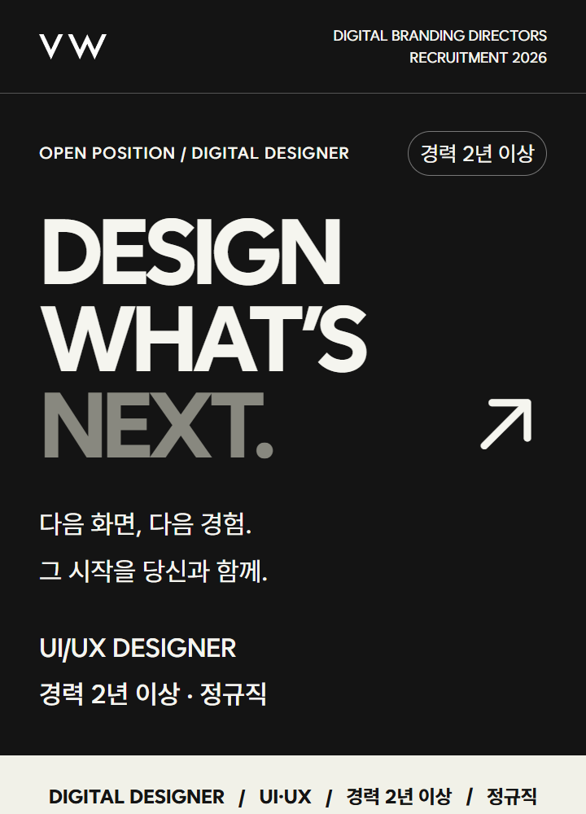

# B · 타이포 포스터 — 디자인 컨셉 v1

기준일: 2026-09-26 · 컨셉 ID: `poster-v1` · 용도: 직무와 채용 회차가 달라도 동일한 시각 언어로 제작하는 채용공고.

[공통 제작 규칙](README.md)과 함께 사용한다. 이 문서는 현재 구현을 기준으로 작성한 디자인 명세다. 아래 참고 이미지는 기준일의 상단 미리보기를 별도로 보관한 것으로, 새 공고 이미지 생성 시 덮어쓰지 않는다.

## 컨셉과 인상

**첫눈에 남는 강한 인상.** 어두운 바탕에 대형 영문 타이포그래피를 세우고, 밝은 정보 영역을 교차시키는 채용 포스터다. 짧고 선명한 메시지로 주목을 만든 뒤 담당 업무를 바로 보여준다.

브랜드를 차분히 소개하는 A안과 달리, B안은 직무가 만들어갈 다음 결과를 먼저 제안한다. 같은 채용 사실을 사용하되 정보의 진입 순서와 시각적 강도를 다르게 한다.

## 유지할 디자인

| 요소 | 기준 |
| --- | --- |
| 기본 배경 / 주요 글자 | `#141414` / `#f5f5ef` |
| 제목의 보조 강조 | `#88887f` — 현재 ‘NEXT.’에 적용 |
| 어두운 영역 보조 본문 | `#b9b9b1` |
| 밝은 요약·자격요건·지원 영역 | 배경 `#f1f1e8`, 글자 `#141414` 또는 `#151515` |
| 회사 생활 설명 영역 | `#272727` |
| 어두운 영역 구분선 | `#555555` |
| 서체 | Wanted Sans, 대형 제목·핵심 헤딩 700, 본문 400 |
| 레이아웃 | 한 장의 세로 포스터. 본문은 1열, 섹션별 명암 전환. |
| 히어로 | 대문자 영문을 짧게 3행 안팎으로 적층. 우하단 ↗ 화살표. |
| 사진 | 흑백 처리. 첫 사진은 화면 폭 전체 사용. 사무실 사진은 간판과 회사명을 보존. |
| 로고 | 어두운 머리글에서는 흰 로고, 밝은 마무리 영역에서는 검은 로고. |

기준 폭은 720 CSS px다. 좌우 주요 여백은 `6.667cqw`(약 48px), 일반 섹션 상하 여백은 `7cqw`(약 50.4px)다. 큰 타이포그래피는 히어로의 특징이며, 본문은 A안과 같은 읽기 크기를 유지한다.

| 타이포 역할 | 현행 공통 CSS 기준 | 720px 표시 시 |
| --- | --- | --- |
| 히어로 제목 | `15.6cqw`, 행간 .95, 자간 `-1cqw` | 약 112.3px |
| 히어로 화살표 | `16cqw` | 약 115.2px |
| 주요 본문 | `4.445cqw`, 행간 1.8 | 약 32px |
| 일반 소제목 | `6.1cqw`, 행간 1.4 | 약 43.9px |
| 업무 제목·조건 값 | `5.56cqw`, 행간 1.5 | 약 40px |
| 지원 마무리 제목 | `8.8cqw`, 굵기 700 | 약 63.4px |

수치는 `common-artwork.css`의 최종 비례 규칙을 기준으로 한다. `Poster.css`에 남아 있는 초기 128px 제목이나 화면별 값을 단독 기준으로 사용하지 않는다.

## 섹션 순서

1. 흰 VW 로고 + 영문 브랜드명 + 채용 연도, 얇은 하단 선.
2. 영문 직무 라벨 + 경력 배지 + 대형 영문 제목 + 한글 초대 문장 + 직무 요약.
3. 밝은 직무·전문분야·경력·고용형태 요약 띠.
4. 담당 업무: 어두운 배경에서 번호·제목·설명을 먼저 제시.
5. 흑백 브랜드 사진 + 작은 영문 캡션.
6. 회사 소개: 어두운 배경과 짧은 제목.
7. 필수 조건과 우대사항: 밝은 배경으로 전환.
8. 근무 조건: 어두운 배경으로 복귀.
9. 회사 생활: 흑백 사무실 사진 + 짙은 회색 복지 영역.
10. 지원 안내: 밝은 배경, 마무리 제목 → 전형 절차 → 제출 자료 → 지원 방법 → 유의사항 → 회사 로고와 사이트.

업무를 회사 소개보다 먼저 제시하는 순서를 유지한다. 항목 수가 늘면 세로로 확장하고, 본문 크기를 줄이거나 여러 열로 압축하지 않는다.

## 내용 교체 규칙

- 헤드라인은 ‘DESIGN / WHAT’S / NEXT.’ 또는 ‘PLAN / WHAT’S / NEXT.’처럼 짧고 역할에 맞는 단어를 쓴다. 기존 예시를 모든 직무에 기계적으로 대입하지 않는다.
- 긴 영문 직무명은 상단 라벨이나 직무 요약에 넣고, 대형 제목에는 짧은 핵심 메시지를 쓴다. 글자를 무조건 줄여 한 줄에 끼워 넣지 않는다.
- 한글 초대 문장은 2행 안팎으로 짧게 쓴다. 어조는 자신감 있고 명확하게 유지하되 과장된 채용 약속을 추가하지 않는다.
- A·B를 함께 제작할 때 업무·경력·급여·근무조건·제출 자료는 같아야 한다. 헤드라인과 회사 소개의 표현만 컨셉에 맞게 조정한다.
- 연도, 직무, 업무, 자격요건, 우대사항, 근무조건은 새 원문에서 확인한다. 기존 경력·연봉 등은 예시 데이터다.
- 접수 시작일·마감일·채용 기간·‘채용 시 마감’은 게시 이미지에 넣지 않는다. 지원 방법은 ‘잡코리아 이력서 양식으로 즉시지원’으로 표시한다.

## 피해야 할 변경

컬러 사진 혼합, 네온·다색 포인트 추가, 둥근 카드 중심 구성, 캐릭터 삽입, 그라데이션·입체 효과, 긴 한글 본문을 대형 포스터 제목으로 사용하는 변경은 이 컨셉에 포함하지 않는다. 밝은 섹션을 모두 없애 어두운 긴 이미지로 만드는 것도 피한다.

## 구현과 검수 기준

- 기준 컴포넌트: [Poster.jsx](../../src/pages/Poster.jsx), [PlannerPoster.jsx](../../src/pages/PlannerPoster.jsx).
- 직무별 본문: [Sections.jsx](../../src/pages/Sections.jsx), [PlannerSections.jsx](../../src/pages/PlannerSections.jsx).
- 스타일: [Poster.css](../../src/pages/Poster.css), [common-artwork.css](../../src/common-artwork.css), [studio-layout.css](../../src/studio-layout.css).
- 현재 전체 게시 이미지: [디자이너 B](../../public/downloads/2026-09-10-designer/poster-3x.png), [기획자 B](../../public/downloads/2026-09-10-planner/poster-3x.png). 이 경로는 현 공고 수정 시 갱신되므로 고정된 버전 스냅샷은 아니다.

최종 PNG를 360px 표시 폭으로 열어 대형 제목과 화살표의 겹침, 제목 잘림, 밝고 어두운 섹션의 순서, 작은 회색 본문의 가독성을 확인한다. 한글 어절·역명과 짧은 단어가 단독으로 남는 줄바꿈도 검수한다. 전체 제작 절차와 요청문 예시는 [공통 문서](README.md)를 따른다.
